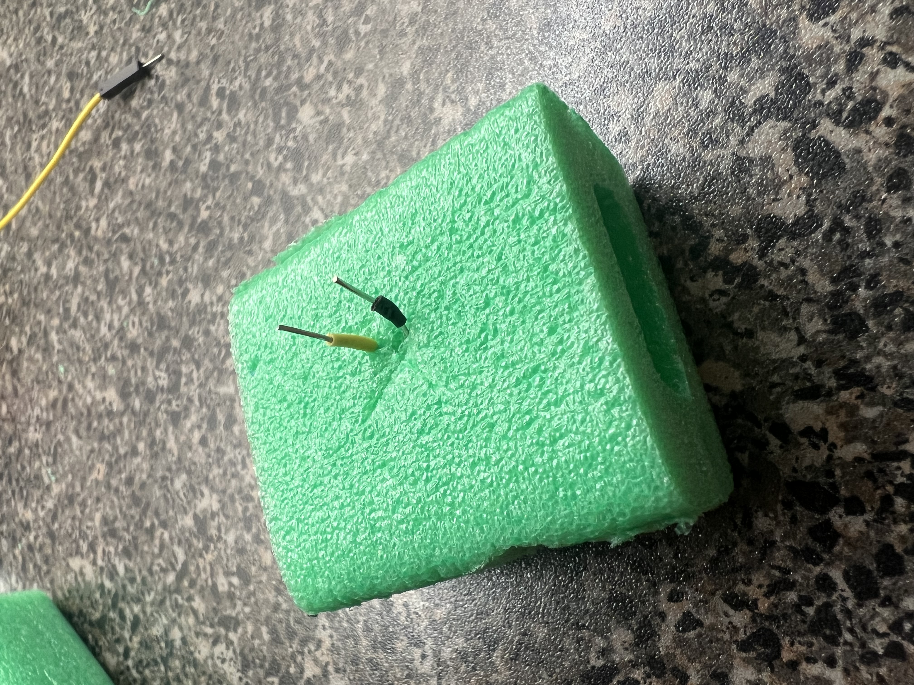

# Synth-Bike-2.0

## Concept
This is my new and improved synth bike. This was a project where I iterated on my old synth bike design, by trying to improve the embodiment of the bike. The first improvement to embodiment was to make it so a user could ride around on the bike, instead of the previous design that required the bike to be connected via USB to a laptop. 

To do this I switched from using an Arduino Uno to a Raspberry Pi pico w. This is because the Arduino Uno does not have a native WiFI component. The bike and laptop now communicate through a socket program connected over a shared local network. The laptop acts as a server, receiving messages from the pico acting as a client. The programming language also changed as the Pico runs on MicroPython, and I wrote the laptop server code in Python as I am no longer using Supercollider for sound generation. The general communication structure is relatively the same though, with the bike generating values based on user inputs and then sending these values to the laptop which interprets them into sound.

The user input was also modified. Instead of using, flat, capacitive touch sensors, I created three-dimensional foam buttons. Feedback from my previous design mentioned that the flat keys may be hard to locate while riding around, these new keys should help this. I also added an extra key, making the total key count 5. The bike still takes the back tire speed as an input, however, it affects the sound volume instead of the sound pitch, I will explain why a bit later. When the user presses some keys the pico will record each press as a note on the C major scale. Since there are only 5 keys, the available notes are middle c, d, e, f, and g. The pico will send this record in a message with the following form

  a-wheel speed-note 1-note 2-...-b

This message format made it easier for the laptop program to deliminate each of the note values.

As mentioned I am no longer using Supercollider, instead I am using the Scamp library for audio generation. This library lets me create instruments as Python variables, where I can play a note or chord on the instrument by calling play_chord(). play_chprd() takes as input a list of notes to play, the sound volume, and the note length. The note list is easily extracted from the message sent from the pico. The volume is a value between 0.0 and 1.0, with 1.0 being the maximum. This is where the new wheel speed mapping comes in as play_chord() does not have any default parameters for changing the pitch. In this new mapping, we have the following ranges of wheel RPM (rotations per minute) to volume level,
- 0.4 for under 60rpm
- 0.6 for 60 to 80 rpm
- 0.8 for 80 to 120rpm
- 1.0 for over 120rpm

Finally, I added glow sticks as I thought they would improve the aesthetic of the bike. I could see people riding this bike around music festivals or events happening at night. Someone at the live demo said they could see people riding the bike around Buring Man, and I think that would be the perfect setting for this bike.

## Circuit Schema

## Photos

## Video Explanation and Demo

[Video](https://youtu.be/bunlOOHyu5c)

## Functionality
The components for this project are
- a Raspberry Pi Pico W
- 5 push buttons
- a photoresistor
- a 10k ohm resistor
- jumper wires
- a bike
- a laptop

To run the code, import client.mpy to the pico. You will need to create a config file that contains your WiFi SSID and password. Next, begin running server.py, it should print out the server's IP address, you will need to make sure this aligns with the IP address the pico is trying to connect to. From this, you can begin running client.mpy on the pico and the two devices should begin to connect. Once connected the terminal running server.py will print the notes in the messages it recieves from the pico, and will print blanks if it has not received a note yet. Once a note is received the laptop will play the note over your speaker of choice.

## References
### Tutorials Used for the Project
- Goodhew, T. (2022, September 9). Wireless Communication Between Two Raspberry Pi Pico W Boards. The PiHut. March 30, 2024, https://thepihut.com/blogs/raspberry-pi-tutorials/wireless-communication-between-two-raspberry-pi-pico-w-boards
- McCreary, D. (n.d.). Light Sensor with Raspberry Pi Pico in MicroPython. MicroPython for Kids. April 2, 2024, https://www.coderdojotc.org/micropython/sensors/02-photosensor/
- Playing Notes in SCAMP! (2020a). YouTube. Retrieved March 30, 2024, from https://www.youtube.com/watch?v=xwxt32ollv0&list=PL_yUKG0GRuliyrzaGyrOl5DRHycCbGsRG.
- Python Socket Programming Tutorial. (2020b). YouTube. Retrieved March 30, 2024, from https://www.youtube.com/watch?v=3QiPPX-KeSc. 

### Image Sources from Video
- Black Pi. (2015). ETCWiki. Retrieved April 6, 2024, from https://www.etcwiki.org/wiki/Wallpapers_-_raspberry_pi.
- CouldNotThinkALot. (2023). Arduino UNO UHD wallpapers (4965 x 2666). Reddit r/arduino. Retrieved April 6, 2024, from https://www.reddit.com/r/arduino/comments/15wcns5/arduino_uno_uhd_wallpapers_4965_x_2666/.
- HD python logo wallpapers. (n.d.). Peakpx. Retrieved April 6, 2024, from https://www.reddit.com/r/arduino/comments/15wcns5/arduino_uno_uhd_wallpapers_4965_x_2666/.
- Hetter, K. (2015). Burning Man ablaze in Nevada desert. CNN Style. Retrieved April 6, 2024, from https://www.cnn.com/style/burning-man-festival-desert-art-temple-pictures/index.html. 
